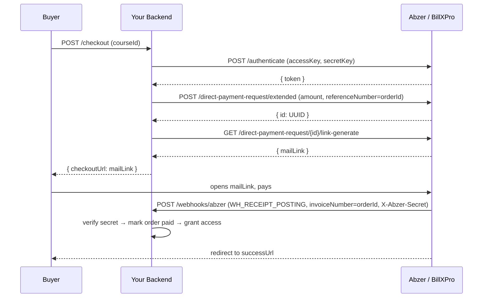

# Abzer Pay (BillXPro) — Integration Guide

A portable, framework-agnostic guide to integrating the **Abzer DMCC / BillXPro**
hosted payment gateway (UAE, AED). Copy this into any Node/Bun/TypeScript backend.
Based on Abzer API **v5.1** and Webhook Docs **v1.0**.

---

## 1. How it works (the flow)

Abzer is a **hosted-redirect** gateway (like Stripe Checkout). You never touch card
data — you create a payment request, get a hosted URL, and redirect the buyer there.

```
1. Authenticate            POST /authenticate                         → Bearer token (60-min TTL)
2. Create payment request  POST /direct-payment-request/extended      → { id: <UUID> }
3. Generate hosted link    GET  /direct-payment-request/{id}/link-generate → { mailLink }
4. Redirect buyer to `mailLink` → they pay on the BillXPro hosted page
5. Abzer → your webhook    POST /webhooks/abzer  (WH_RECEIPT_POSTING, paymentStatus=Success)
6. You fulfill the order   (mark paid, grant access) — keyed by invoiceNumber = your orderId
```

Key idea: you pass **your own order ID** as `referenceNumber` when creating the
request. Abzer echoes it back in the webhook as `invoiceNumber`, so you can match the
payment to your order.

### Sequence diagram



---

## 2. Prerequisites

From your Abzer / BillXPro merchant account you need:

| Item | Where |
|---|---|
| `accessKey` + `secretKey` | Abzer admin → API credentials |
| Template code | Abzer admin → payment-link template (default `paymentlink-mail-template`) |
| Webhook secret header | Abzer admin → Webhook → Headers → add `X-Abzer-Secret: <your-secret>` |
| Base URL | Production: `https://billxpro.com/as/api/v100` (sandbox differs — ask Abzer) |

**In the Abzer admin console, configure the webhook** to `POST` to
`https://your-api.com/webhooks/abzer` with a custom header `X-Abzer-Secret` set to the
same value you put in `ABZER_WEBHOOK_SECRET`.

---

## 3. Environment variables

```bash
ABZER_ACCESS_KEY=          # required — merchant access key
ABZER_SECRET_KEY=          # required — merchant secret key
ABZER_TEMPLATE_CODE=paymentlink-mail-template   # payment-link template code
ABZER_WEBHOOK_SECRET=      # required — value of the X-Abzer-Secret header you set in Abzer admin
ABZER_BASE_URL=https://billxpro.com/as/api/v100 # gateway base URL
ABZER_CURRENCY=AED         # 3-letter currency (Abzer settles in AED)

# Used to build redirect URLs
CLIENT_URL=https://your-frontend.com
```

---

## 4. The service (drop-in)

Self-contained TypeScript class using `fetch` and `process.env` — no framework deps.

```ts
// abzer.service.ts
const BASE = process.env.ABZER_BASE_URL || 'https://billxpro.com/as/api/v100'

/* Module-level token cache, shared across instances. Token is valid 60 min;
   we refresh at 50 to leave a safety margin. */
let _cachedToken: { token: string; expiresAt: number } | null = null

async function fetchAbzerToken(): Promise<string> {
  if (_cachedToken && Date.now() < _cachedToken.expiresAt) return _cachedToken.token

  const resp = await fetch(`${BASE}/authenticate`, {
    method: 'POST',
    headers: { 'Content-Type': 'application/json' },
    body: JSON.stringify({
      accessKey: process.env.ABZER_ACCESS_KEY,
      secretKey: process.env.ABZER_SECRET_KEY,
    }),
  })
  if (!resp.ok) throw new Error(`Abzer auth failed (${resp.status}): ${await resp.text()}`)

  const data = await resp.json() as { accessKey: string; token: string }
  _cachedToken = { token: data.token, expiresAt: Date.now() + 50 * 60 * 1000 }
  return data.token
}

export interface AbzerCreateOrderOptions {
  amountAED: number   // decimal AED, e.g. 199.00
  orderId: string     // YOUR order id — sent as referenceNumber, returned as invoiceNumber
  buyerEmail: string
  buyerName: string
  buyerPhone?: string
}

export interface AbzerCreateOrderResult {
  abzerRequestId: string   // Abzer UUID (store it for reference)
  checkoutUrl: string      // mailLink — redirect the buyer here
}

export class AbzerService {
  async createOrder(opts: AbzerCreateOrderOptions): Promise<AbzerCreateOrderResult> {
    if (!process.env.ABZER_ACCESS_KEY || !process.env.ABZER_SECRET_KEY) {
      throw new Error('ABZER_ACCESS_KEY and ABZER_SECRET_KEY must be configured')
    }
    const token = await fetchAbzerToken()

    // Abzer wants first/last name separately
    const parts = opts.buyerName.trim().split(/\s+/)
    const firstName = parts[0]
    const lastName  = parts.length > 1 ? parts.slice(1).join(' ') : parts[0]

    const returnBase = `${process.env.CLIENT_URL}/payment-return`

    // Step 1 — create the direct payment request
    const createResp = await fetch(`${BASE}/direct-payment-request/extended`, {
      method: 'POST',
      headers: { 'Content-Type': 'application/json', Authorization: `Bearer ${token}` },
      body: JSON.stringify({
        templateConfiguration: { code: process.env.ABZER_TEMPLATE_CODE || 'paymentlink-mail-template' },
        firstName,
        lastName,
        email: opts.buyerEmail,
        mobileNo: opts.buyerPhone ?? '',
        amount: opts.amountAED,
        referenceNumber: opts.orderId,   // ← echoed back as invoiceNumber in the webhook
        successUrl: returnBase,
        failureUrl: returnBase,
        cancelUrl: returnBase,
      }),
    })
    if (!createResp.ok) throw new Error(`Abzer create failed (${createResp.status}): ${await createResp.text()}`)

    const { id: abzerRequestId } = await createResp.json() as { id: string }
    if (!abzerRequestId) throw new Error('Abzer did not return a payment request ID')

    // Step 2 — generate the hosted payment link
    const linkResp = await fetch(`${BASE}/direct-payment-request/${abzerRequestId}/link-generate`, {
      method: 'GET',
      headers: { Authorization: `Bearer ${token}` },
    })
    if (!linkResp.ok) throw new Error(`Abzer link-generate failed (${linkResp.status}): ${await linkResp.text()}`)

    const linkData = await linkResp.json() as { mailLink: string; isLinkExpired: boolean }
    if (linkData.isLinkExpired || !linkData.mailLink) {
      throw new Error('Abzer returned an expired or empty payment link.')
    }

    return { abzerRequestId, checkoutUrl: linkData.mailLink }
  }
}
```

---

## 5. Create-checkout endpoint

```ts
// POST /checkout/abzer/create-order   (auth required)
router.post('/abzer/create-order', authenticate, async (req, res, next) => {
  try {
    // 1. price the order server-side (NEVER trust an amount from the client)
    const order = await createOrderRecord({ userId: req.user.id, courseId: req.body.courseId, gateway: 'abzer' })

    // 2. create the Abzer payment link
    const { checkoutUrl, abzerRequestId } = await new AbzerService().createOrder({
      amountAED: order.amount / 100,   // store minor units (fils), send decimal AED
      orderId: order.id,
      buyerEmail: req.user.email,
      buyerName: req.user.name,
      buyerPhone: req.user.phone,
    })

    // 3. save the Abzer request id, return the URL for the browser to redirect to
    await saveAbzerRequestId(order.id, abzerRequestId)
    res.json({ checkoutUrl })
  } catch (err) { next(err) }
})
```

---

## 6. Webhook handler (the source of truth)

This is where you **actually fulfill the order**. Everything else is UI.

```ts
// POST /webhooks/abzer
router.post('/abzer', async (req, res) => {
  // 0. If not configured, ignore silently
  if (!process.env.ABZER_WEBHOOK_SECRET) return res.status(200).json({ received: true })

  // 1. Verify the custom header (timing-safe compare). Reject if it doesn't match.
  const presented = req.headers['x-abzer-secret'] ?? req.headers['x-apikey']
  if (!safeEqual(presented, process.env.ABZER_WEBHOOK_SECRET)) {
    return res.status(200).json({ received: true })   // 200 so Abzer doesn't retry
  }

  // 2. Parse (Abzer may send raw Buffer / string / json)
  let payload
  try {
    const raw = req.body
    payload = Buffer.isBuffer(raw) ? JSON.parse(raw.toString('utf8'))
            : typeof raw === 'string' ? JSON.parse(raw) : raw
  } catch { return res.status(200).json({ received: true }) }

  // 3. Only act on a successful receipt posting
  const { type, paymentStatus, invoiceNumber: orderId, receiptId } = payload
  if (type === 'WH_RECEIPT_POSTING' && paymentStatus === 'Success' && orderId && receiptId) {
    await fulfillOrder(orderId, receiptId)   // ← idempotent, see below
  }

  // 4. ALWAYS 200 — a non-200 makes Abzer retry endlessly
  res.status(200).json({ received: true })
})
```

**Idempotent fulfillment** — the webhook can fire more than once, and the browser
return can race it, so guard with a conditional update:

```ts
async function fulfillOrder(orderId: string, receiptId: string) {
  const order = await orders.findById(orderId)
  if (!order || order.status === 'paid') return          // already done / unknown

  // Atomic flip: only one caller wins, only the winner runs side effects
  const won = await orders.updateOne(
    { _id: orderId, status: { $ne: 'paid' } },
    { $set: { status: 'paid', receiptId } },
  )
  if (won.modifiedCount === 0) return                     // someone else fulfilled it

  await grantAccess(order.userId, order.courseId)         // your side effects
}
```

---

## 7. Return URL (fallback only — NEVER fulfill here)

After payment Abzer redirects the buyer to your `successUrl`. Use a return endpoint
**only to show status** — poll the order that the webhook already fulfilled. Do **not**
mark the order paid from the return URL.

```ts
// POST /checkout/abzer/verify-return  — READ ONLY
router.post('/abzer/verify-return', authenticate, async (req, res, next) => {
  const order = await orders.findById(req.body.orderId)
  if (order.userId.toString() !== req.user.id) throw new ForbiddenError()

  // brief wait — the redirect often beats the server-to-server webhook by ~200ms
  await new Promise(r => setTimeout(r, 1500))
  const fresh = await orders.findById(req.body.orderId)
  res.json({ paid: fresh.status === 'paid' })
})
```

> ⚠️ **Security lesson (real bug that shipped and was fixed):** an earlier version
> fulfilled the order *directly from the return URL* with no verification. Because the
> return URL is just a browser redirect the user controls, three requests
> (register → create-order → verify-return) bought any course **for free** and upgraded
> the account. **The webhook — verified by `X-Abzer-Secret` — is the only trusted path.**
> The return URL must be read-only.

---

## 8. Security checklist

- [ ] **Verify `X-Abzer-Secret`** on every webhook with a **timing-safe** compare (`crypto.timingSafeEqual`), not `===`.
- [ ] **Fulfill only from the webhook**, never from the return URL.
- [ ] **Price server-side.** Never accept an amount from the client — look up the product price yourself.
- [ ] **Idempotent fulfillment** via a conditional/atomic status flip (webhook retries + return-URL race).
- [ ] **Always return HTTP 200** from the webhook, even on errors, or Abzer retries forever.
- [ ] Store `abzerRequestId` (create UUID) and `receiptId` (webhook) on the order for reconciliation.
- [ ] Keep `ABZER_SECRET_KEY` / `ABZER_WEBHOOK_SECRET` server-side only — never ship to the frontend.

---

## 9. API reference (quick)

| Step | Method | Path | Auth | Returns |
|---|---|---|---|---|
| Authenticate | POST | `/authenticate` | body: accessKey, secretKey | `{ token }` (60-min) |
| Create request | POST | `/direct-payment-request/extended` | Bearer | `{ id }` (UUID) |
| Generate link | GET | `/direct-payment-request/{id}/link-generate` | Bearer | `{ mailLink, isLinkExpired }` |

**Create-request body:** `templateConfiguration.code`, `firstName`, `lastName`,
`email`, `mobileNo`, `amount` (decimal AED), `referenceNumber` (your order id),
`successUrl`, `failureUrl`, `cancelUrl`.

**Webhook payload (`WH_RECEIPT_POSTING`):**
```jsonc
{
  "type": "WH_RECEIPT_POSTING",
  "paymentStatus": "Success",        // or "Pending Approval"
  "receiptId": "<abzer receipt uuid>",
  "receiptNumber": "...",
  "receiptAmount": 199.00,
  "collectedCurrency": "AED",
  "invoiceNumber": "<your orderId>",  // = the referenceNumber you sent
  "customerName": "..."
}
```

---

## 10. Gotchas

- **Token is cached 50 min** (valid 60). Cache it module-level and refresh at 50 — do not authenticate per request.
- **Name split:** Abzer needs `firstName` + `lastName` separately; if only one word is given, reuse it for both.
- **Sandbox webhooks are unreliable** — that's why the read-only return-URL poll exists as UX fallback. Fulfillment still only happens via the (verified) webhook.
- **Amounts:** store money as integer minor units (fils) internally; send `amount` as decimal AED (`fils / 100`) to Abzer.
- **`link-generate` can return an expired link** (`isLinkExpired: true`) — check it and surface a retry.
